## Ejercicios Tema 2, Desarrollo basado en pruebas

### Ejercicio 1
**Instalar alguno de los entornos virtuales de node.js (o de cualquier otro lenguaje con el que se esté familiarizado) y, con ellos, instalar la última versión existente, la versión minor más actual de la 4.x y lo mismo para la 0.11 o alguna impar (de desarrollo).**  
Vamos a instalar el entorno virtual de nvm. Para ello hemos seguido los pasos que aparecen en su [repositorio de GitHub](https://github.com/nvm-sh/nvm#install--update-script).

Descargamos nvm:\
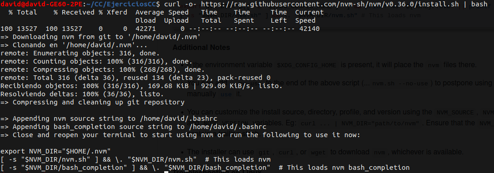\
Y comprobamos que lo tenemos instalado:\
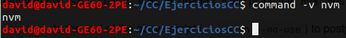\
Instalamos la última versión de [node](https://nodejs.org/en/):
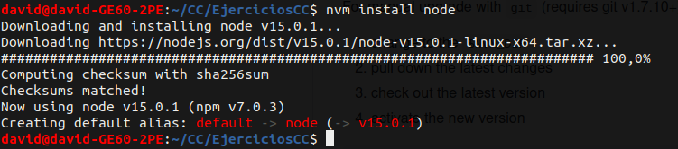\
Con el siguiente comando tendremos una lista de todos las versioens de node:\
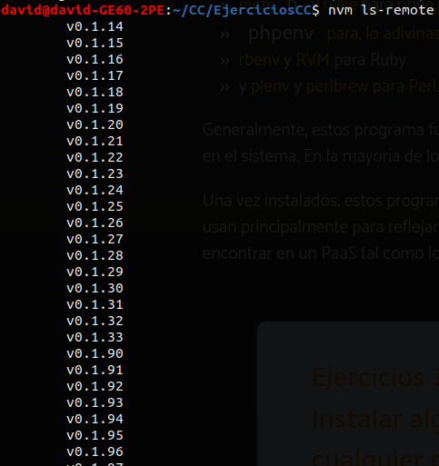\
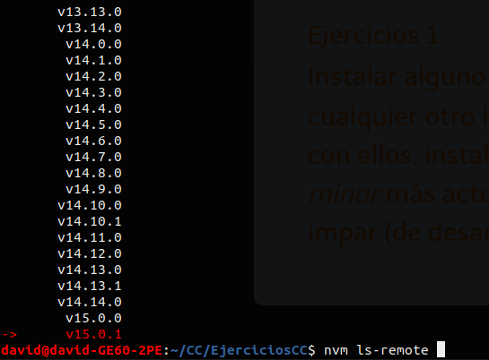\
Y podemos instalar las versiones que deseamos, ejecutando el comando mostrado en la imagen:\
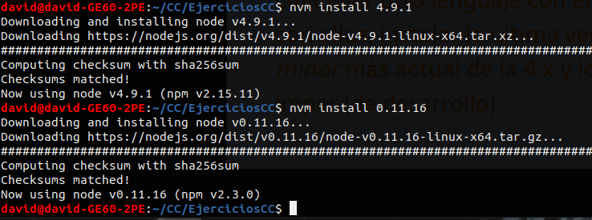\
Podemos mostrar las versiones instaladas y vemos que tenemos las anteriores que hemos seleccionado:\
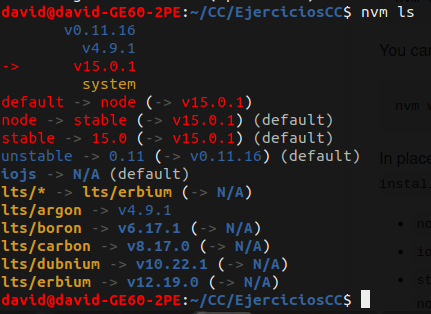\
Con el siguiente omando, seleccionamos la más reciente:\
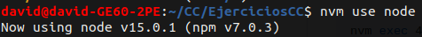

### Ejercicio 2
**Crear una descripción del módulo usando package.json. En caso de que se trate de otro lenguaje, usar el método correspondiente.**  
Para crear el [package.json](./package.json) ejecutamos `npm init` y rellenamos con los datos que nos pide:\
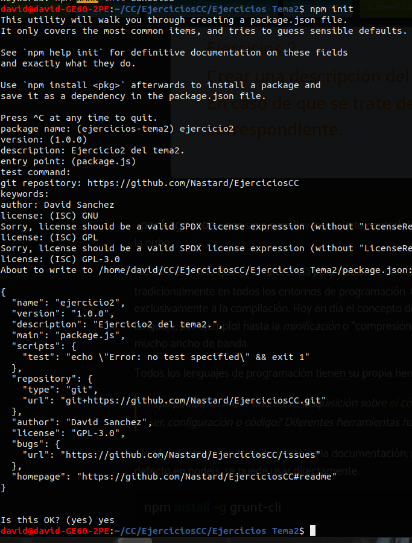\
Podemos instalar los paquetes deseados...\
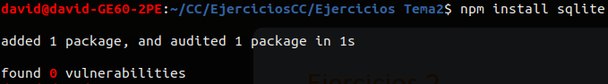\
... y vemos como se tiene en cuenta para el módulo:\
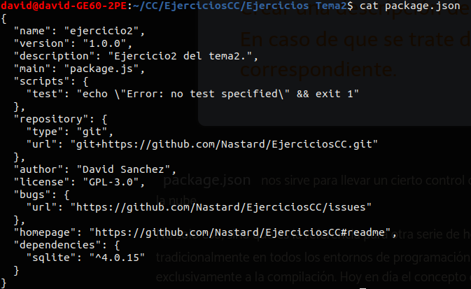

### Ejercicio 3
**Descargar el repositorio de ejemplo anterior, instalar las herramientas necesarias (principalmente Scala y sbt) y ejecutar el ejemplo desde sbt. Alternativamente, buscar otros marcos para REST en Scala tales como Finatra o Scalatra y probar los ejemplos que se incluyan en el repositorio.**  
Antes de nada debemos clonar el repositorio deseado con `git clone` y comprobar que Java y JDK estén instalados, ya que Scala los necesita:\
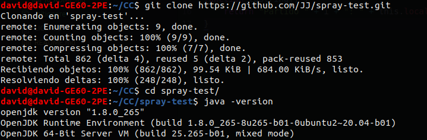\
Instalamos Scala:
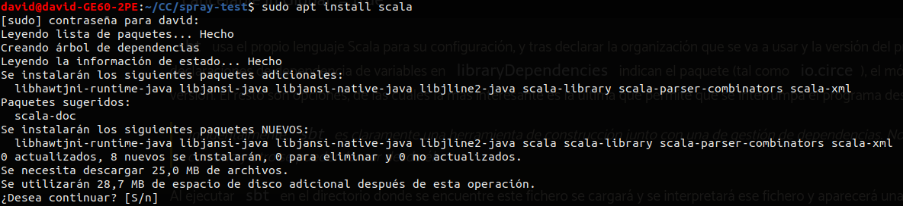\
Ejecutamos el siguiente comando para poder descargar e instalar sbt, y realizamos un `update`:\
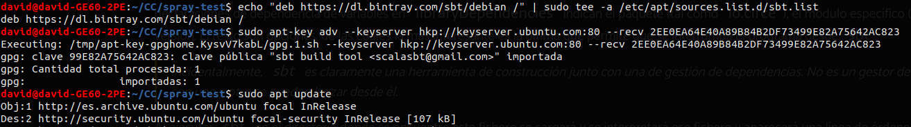\
Y ahora instalamos sbt:\
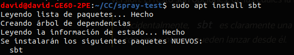\
Comprobamos que está instalado, puede tardar un poco en iniciarse:\
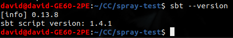\
Ahora iniciamos sbt:\
\
Y ejecutamos test para compilar:\
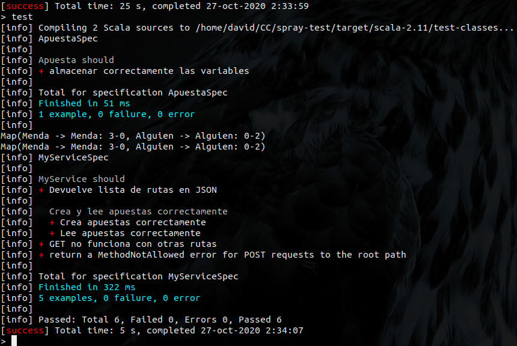\
Una vez finalizado, reiniciamos el servicio para tener acceso:\
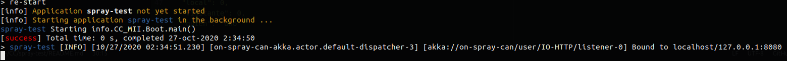\
Y como podemos ver en la siguiente imagen, podemos acceder:\
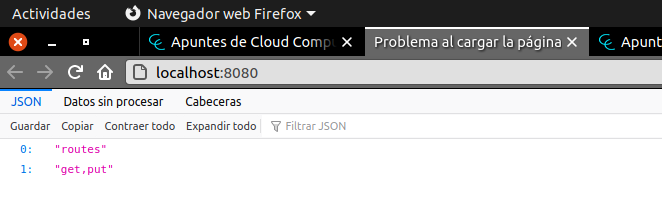\
También podemos realizar una serie de ejemplos usando PUT y GET:\
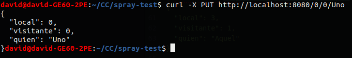\
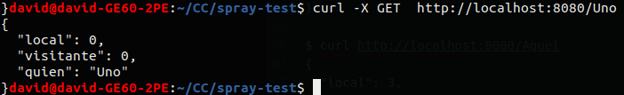

### Ejercicio 4
**Para la aplicación que se está haciendo, escribir una serie de aserciones y probar que efectivamente no fallan. Añadir tests para una nueva funcionalidad, probar que falla y escribir el código para que no lo haga. A continuación, ejecutarlos desde mocha (u otro módulo de test de alto nivel), usando descripciones del test y del grupo de test de forma correcta. Si hasta ahora no has subido el código que has venido realizando a GitHub, es el momento de hacerlo, porque lo vamos a necesitar un poco más adelante.**  

Antes de nada instalamos [Mocha](https://mochajs.org/) siguiendo los pasos de su web:\
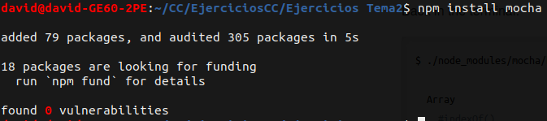\
Una vez finalizado, hemos creado la clase [Apuesta.js](./Apuesta.js) y el archivo de [test](./test.js). Hemos modificado [package.json](./package.json) para que en la sección de `test` ejecute a mocha:\
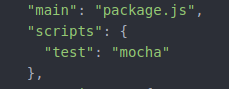\
Tras definir los test, estando un de ellos mal, si ejecutamos obtendremos el siguiente resultado, donde se aprecia que el último test ha fallado, mostrando lo que nos debería mostrar:\
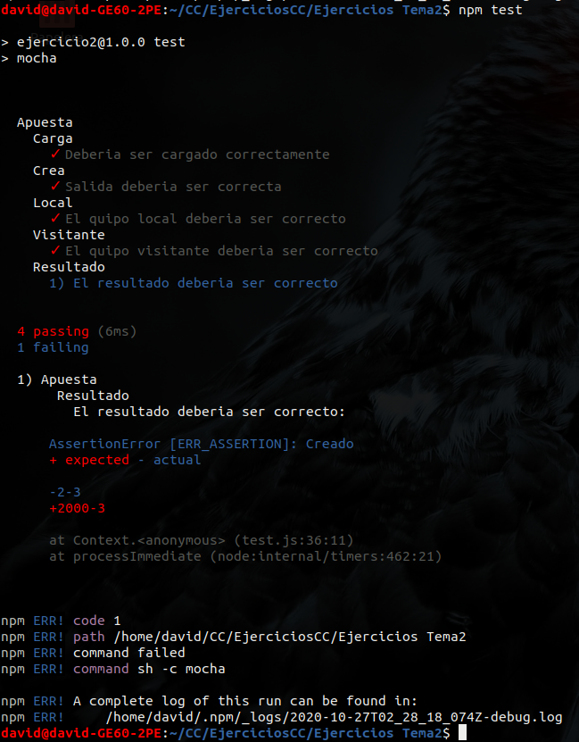\
Lo arreglamos y ya no tenemos el error:\
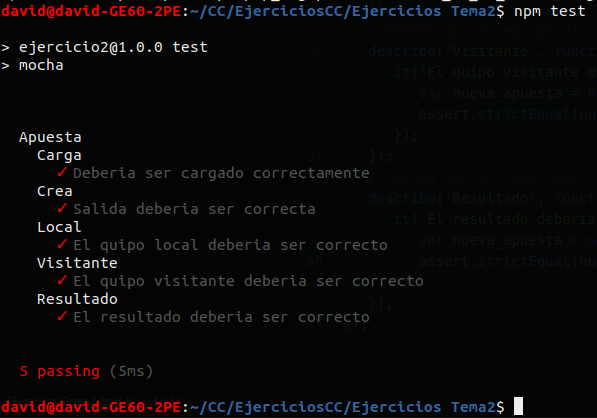

### Ejercicio 5
**Ejercicio: Haced los dos primeros pasos antes de pasar al tercero.**  
Nos hemos dado de alta en [Travis](https://travis-ci.org/) y habilitado el respositorio para que aplique la integración continua:\
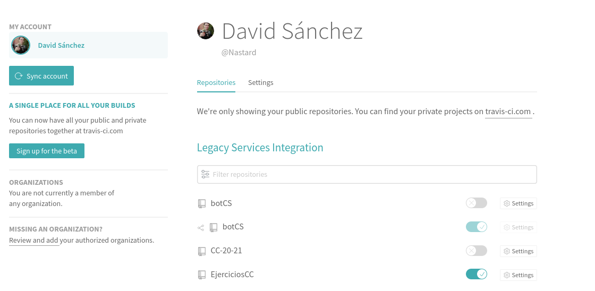\
Y ahora tras subir el [archivo necesario](./.travis.yml) de Travis vemos como los test pasasn correctamente:\
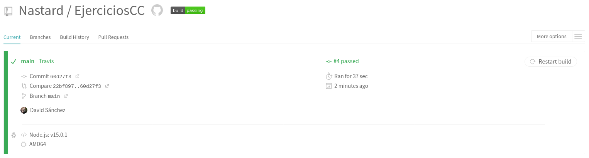
